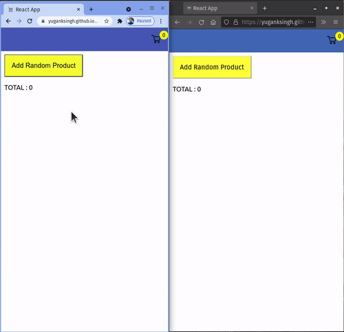

# Realtime Cart

Realtime Cart using Firestore and React

[See Live Version](https://yuganksingh.github.io/react-cart/)

# What I learned

- Passing Data in React using props
- Sharing data between siblings
- Using Firebase' Firestore to do realtime CRUD operations
- Using Github Actions to automate the build and deployting it on github pages
- Using github secrets